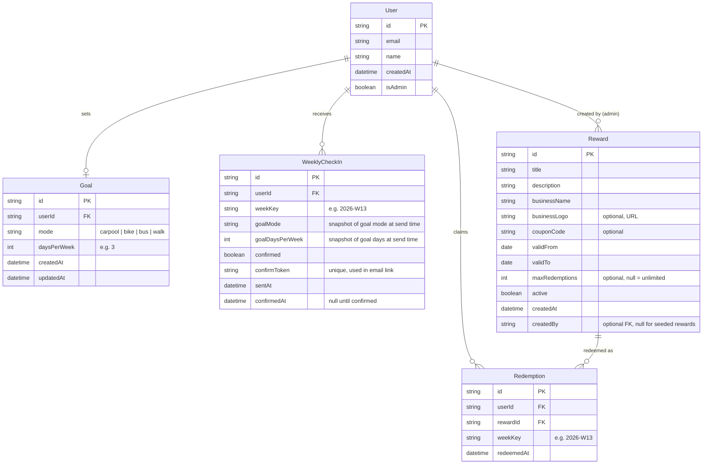

# Spec

Ride Shift RVA: move green, save green

Cars are the dominant mode of commuting in Richmond, VA — contributing to congestion, emissions, and parking strain. There's no structured incentive for residents to choose alternatives like carpooling, biking, transit, or walking. Meanwhile, local businesses want foot traffic and community goodwill but lack a direct channel to reward sustainable behavior.

This hackathon app connects the two: commuters who set a weekly car-free goal and follow through unlock coupons from local Richmond businesses. The goal is a simple, usable MVP that demonstrates the concept and could attract city or business sponsorship.

## Proposed solution

A Next.js web app where users set a personal commute goal, receive a weekly check-in email asking if they met it, and unlock reward coupons when they confirm. An admin interface (stretch goal) lets organizers manage rewards; for the core demo, rewards are seeded.

The tracking model is honor-system by design — users self-report whether they met their goal. This keeps the app simple and removes the friction of logging individual trips.

### Tech stack

| Layer | Choice | Rationale |
| --- | --- | --- |
| Framework | Next.js (App Router) | Fast to build, SSR, API routes in one project |
| UI | HeroUI | Pre-built component library, good for rapid prototyping |
| Auth | Auth.js (NextAuth v5) | Magic link authentication — no passwords to manage |
| Email | Amazon SES | Existing AWS/SES setup — used for magic links and weekly check-ins |
| Database | MongoDB | Flexible schema, free tier on Atlas, fast to iterate |
| ORM | Prisma | Type-safe queries, good MongoDB support, schema-as-code |
| Deployment | Vercel | Zero-config Next.js hosting, free tier |
| Scheduling | Vercel Cron | Triggers the weekly check-in email job. See [scaling note](https://www.notion.so/Spec-3315dd29c21d80178b0eda94e552149e?pvs=21). |

### Core concepts

**Goal** — A user's personal weekly commitment. They choose a mode (carpool, bike, bus, walk) and a number of days (e.g., "bike 3 days this week"). A user has at most one goal, edited in place. The goal persists week to week until changed. A user can also clear their goal entirely to stop receiving weekly emails; the dashboard returns to the goal-setup prompt.

**Weekly check-in** — At the end of each week, the app emails every user who has a goal: "Did you meet your goal this week?" The email contains a one-click confirm link. Clicking it records a successful week and unlocks that week's rewards. The check-in record snapshots the user's goal at creation time, so the email and confirmation always reference what the user committed to that week — even if they change their goal later.

**Reward** — A coupon or offer from a local business, active for a specific date range. Rewards become claimable once a user confirms their weekly check-in.

**Redemption** — Tracks that a user has claimed a specific reward for a specific week. Prevents duplicate claims and provides analytics on engagement.

### Data model



The ERD shows app-specific fields only. The Prisma schema must also include Auth.js adapter fields on the User model (e.g., `emailVerified`) and the adapter models (Account, Session, VerificationToken). These are omitted from the ERD to keep it focused on domain modeling.

### Rewards system

The reward system is the primary motivator — it needs to feel tangible and worth the effort even before the user has confirmed their week.

### What users see before confirming

The dashboard always shows a **reward summary** for the current week: a preview of what's available without revealing the actual coupon codes. Rewards are visible as motivation all week, but can only be unlocked after the Sunday check-in. Before confirming, users see "Complete your check-in on Sunday to unlock."

The summary shows:

- Number of rewards available this week (e.g., "4 rewards from local businesses")
- Business logo, name, and reward title for each (e.g., Lamplighter Coffee logo + "Free drip coffee with any pastry")
- A message like "Meet your goal this week to unlock these rewards"

### What users see after confirming

Once the user confirms their weekly check-in (via the email link), the dashboard's reward summary transitions to the full reward view — no separate route needed:

- Each reward card expands to show the full description and coupon code (or redemption instructions)
- A "Claim" button records the redemption and marks it as claimed in the UI
- Claimed rewards show a checkmark but remain visible for reference (the user may need the code again during the week)

### Reward lifecycle

Rewards have a `validFrom` and `validTo` date range. A reward is available for any week that overlaps its validity window — so a reward valid from March 1–31 appears in all four weeks of March. This lets admins set up monthly deals without creating four separate reward entries.

To determine which rewards are available for a given week key (e.g., `2026-W13`), convert the ISO week to its Monday and Sunday dates and query for rewards where `validFrom <= Sunday` and `validTo >= Monday`. Note that ISO week boundaries can cross year boundaries (e.g., `2026-W01` starts on 2025-12-29) — use a date library that handles ISO week-to-date conversion correctly (date-fns `startOfISOWeek` / `endOfISOWeek`, or similar).

A reward with `maxRedemptions` set limits total claims across all users and all weeks (lifetime cap, e.g., "first 50 people"). Once the cap is hit, the reward still appears in the summary but shows "All claimed" instead of a claim button.

If no rewards have validity windows overlapping the current week, the reward summary shows an empty state: "No rewards available this week — check back soon!"

### Redemption model

- A `WeeklyCheckIn` is unique per user per week (unique constraint on `userId + weekKey`). This also makes cron retries safe — if the job runs twice, the second run skips users who already have a record for that week.
- A user can claim each reward at most once per week (unique constraint on `userId + rewardId + weekKey`).
- Note: Prisma's `@@unique` on MongoDB requires a corresponding unique index — verify that `prisma db push` creates it correctly, as MongoDB index handling differs from relational databases.
- The claim endpoint must verify that a confirmed `WeeklyCheckIn` exists for the requesting user and week before allowing a redemption — the data model alone doesn't enforce this.
- "Claiming" reveals the coupon code / offer details and records the redemption. Actual use at the business is honor-system — out of scope for the app.
- Redemption records enable basic analytics: which rewards are popular, how many people confirmed their goals, etc.

### Weekly check-in flow

1. **Cron job fires** — a Vercel Cron route runs every Sunday evening (e.g., 6 PM ET). It queries all users who have a Goal.
2. **Generate check-in record** — for each user, create a `WeeklyCheckIn` document with `confirmed: false`, a unique `confirmToken`, and a snapshot of the user's current goal (`goalMode`, `goalDaysPerWeek`). The unique constraint on `userId + weekKey` means this is a no-op if the record already exists, making retries safe.
3. **Send email via SES** — each user receives an email: "Did you meet your goal this week? (bike 3 days)" referencing the snapshotted goal from the check-in record. The email includes a prominent "Yes, I did it!" link pointing to `/checkin/confirm?token={confirmToken}`.
4. **User clicks confirm** — the `/checkin/confirm` route looks up the token, sets `confirmed: true` and `confirmedAt`, and nulls out `confirmToken`. If the user has an active session, it redirects to the dashboard where rewards are now unlocked. If the user is not logged in, it redirects to the sign-in page with a flash message ("Goal confirmed! Sign in to claim your rewards."). If the token is not found (already used), the page shows "Already confirmed" and redirects to the dashboard (or sign-in, same logic).
5. **No response** — if the user doesn't click, the check-in stays unconfirmed. No rewards for that week. No nagging follow-up in MVP.

**Ordering: record first, then send.** The check-in record is created before the email is sent (step 2), with `sentAt` left null. After the SES send succeeds (step 3), `sentAt` is set to the current timestamp. If the send fails, the user has a record but no email — acceptable for the hackathon MVP. The unique constraint on `userId + weekKey` prevents duplicates on retry.

**Scaling note:** For the hackathon demo (small user count), sending emails synchronously within a single Vercel Cron invocation is fine. At scale, the Vercel function timeout (10s on Hobby, 60s on Pro) would require fanning out to individual sends or using a queue. This is a known constraint, not a blocker for the demo.

Tokens should be cryptographically random (32-byte hex) and single-use. See step 4 above for the full confirm flow, including session-aware redirect logic.

### User flows

### Commuter flow

1. **Land on homepage** — sees value prop, CTA to sign in
2. **Sign in via magic link** — enters email, receives link via SES, clicks to authenticate
3. **Set goal** — first-time users are prompted to set their goal: pick a mode and number of days. This is a simple form, not a wizard.
4. **Dashboard** — sees their current goal, the reward summary for this week, and their check-in history (confirmed weeks). A user with zero confirmed weeks sees the reward summary and goal but an empty history section ("No check-ins yet — your first one arrives Sunday!").
5. **Receive weekly email** — Sunday evening: "Did you bike 3 days this week?" with a confirm link
6. **Confirm** — clicks the link, lands on dashboard with rewards unlocked
7. **Claim reward** — taps claim on a reward card to reveal details and coupon code. Redemption is recorded.

### Admin flow (stretch goal)

1. **Admin dashboard** — accessible at `/admin`, gated by `isAdmin` flag on user record
2. **Manage rewards** — CRUD interface for rewards. Create a reward with title, description, business name, optional logo URL, coupon code, valid date range, and optional max redemptions.
3. **View stats** — simple counts: total users, users with goals, check-ins confirmed this week, redemptions by reward. With zero data, each stat shows "0" — no special empty state needed.

For the hackathon demo, rewards are seeded via a Prisma seed script. Team members are sourcing real business partnerships and will provide the reward content — the seed script just needs to support loading that data (roughly five rewards).

### Page structure

```
/                        → Landing page (unauthenticated) / Dashboard (authenticated)
/auth/signin             → Magic link sign-in form
/auth/verify             → "Check your email" interstitial
/goal                    → Set or update personal goal
/checkin/confirm         → Confirm weekly check-in (token-based, works without session)
/admin                   → Admin dashboard with stats (stretch goal)
/admin/rewards           → Reward list + create/edit (stretch goal)
/admin/rewards/[id]      → Edit reward (stretch goal)
```

### Authentication

Auth.js with the Email provider (magic link) via Amazon SES. The Prisma adapter for Auth.js is required — the magic link flow stores verification tokens in the database. The Prisma schema must include the Auth.js adapter models (Account, Session, VerificationToken) alongside the app models defined in the ERD above.

- User enters email → Auth.js sends a magic link via SES
- On first sign-in, a User document is created in MongoDB with `isAdmin: false`
- Admin users are bootstrapped by setting `isAdmin: true` directly in the database (or via the seed script). No self-service admin registration.
- Auth.js middleware protects `/admin/*` routes, checking the `isAdmin` flag from the session. This requires configuring the Auth.js `session` callback to copy `isAdmin` from the user record into the session/JWT — Auth.js does not include custom user fields by default.

### Weekly timing

- A "week" runs Monday 00:00 → Sunday 23:59 UTC
- The week key is an ISO week string like `2026-W13`
- The cron job is pinned to UTC. It fires Sunday evening before the week ends — intentional, since the honor-system model doesn't require waiting until midnight. The `weekKey` is set at record creation time (not derived from confirmation time), so late confirmations always attribute to the correct week.
- Check-in emails go out Sunday evening. Users can confirm anytime after receiving the email — there's no expiration in the MVP. (A future version might cap confirmations to prevent gaming old weeks.)

### Hackathon scope

**Core demo (must-have):**

- Magic link auth
- Goal setting (pick mode + days per week)
- Dashboard with goal, reward summary, and check-in history
- Weekly check-in email via SES + Vercel Cron
- One-click confirm → reward unlock flow
- Reward claiming
- Seed script for loading reward data (team is sourcing real business partnerships)

**Stretch goal:**

- Admin CRUD for rewards
- Stats dashboard

## Out of scope

- **GPS/location tracking** — goals are self-reported. No geofencing or route verification.
- **Native mobile app** — web-only for the hackathon. The app should be mobile-responsive.
- **Payment or real commerce** — rewards are coupon codes / descriptions. No payment processing, no point system, no wallet.
- **Business self-service portal** — admins create rewards on behalf of businesses. No business-facing login.
- **Social features** — no leaderboards, teams, or sharing (good future work but not MVP).
- **Trip logging** — the app trusts users to self-report via weekly check-in. Individual trip tracking is future work.
- **Check-in expiration** — confirm links don't expire in the MVP. Future versions could add a window.

## Future work

- **Trip logging** — optional detailed tracking for users who want to see their commute history and patterns
- **Employer partnerships** — companies could sponsor goals for their employees, with custom reward pools
- **Leaderboards and social** — weekly/monthly leaderboards, team challenges, social sharing
- **Trip verification** — integrate with transit APIs, bike-share systems, or GPS to auto-detect trips
- **Point system** — accumulate points across weeks for higher-tier rewards
- **Business portal** — let businesses manage their own rewards directly
- **Check-in reminders** — follow-up email if the user hasn't confirmed by Monday
- **Analytics dashboard** — impact metrics (estimated CO2 saved, miles not driven) for city/sponsor reporting

[Site Copy](https://www.notion.so/Site-Copy-3315dd29c21d8049b031dacbedd6a259?pvs=21)

[Script](https://www.notion.so/Script-3315dd29c21d801f8da3eddcf4a00e69?pvs=21)